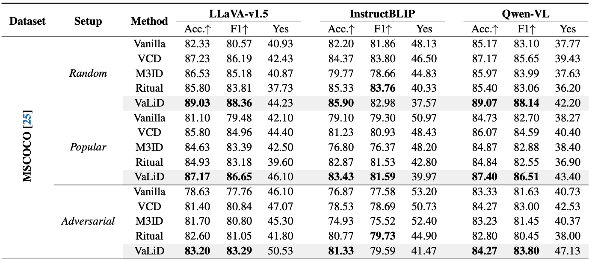

# VaLiD: Mitigating the Hallucination of Large Vision Language Models by Visual Layer Fusion Contrastive Decoding
<div align="center">
Jiaqi Wang<sup>1</sup>, Yifei Gao<sup>1</sup> and, Jitao Sang*<sup>1,2</sup>
</div>
<div align="center">
<sup>1</sup>Beijing Jiaotong University    <sup>2</sup>Peng cheng Laboratory
</div>
<div align="center">
*Corresponding Author
</div>

<!-- Arxiv Link, Project Link -->
<div style='display:flex; gap: 0.25rem; '>
<a href="https://arxiv.org/abs/2411.15839"></a>
<a href="https://github.com/LucusFigoGao"></a>
<a href='LICENSE'></a>
</div>

<!-- **V**isu**a**l **L**ayer Fus**i**on Contrastive **D**ecoding (VaLiD). -->

This is the official repo for Visual Layer Fusion Contrastive Decoding, a novel hallucination-mitigation method from the visual encoding perspective.

## 🔥 Update
- [2025-03-03] 🚀 Codes released.
- [2024-11-15] ⭐️ Paper of VaLiD online. Check out [this line](https://arxiv.org/abs/2411.15839) for more details.

## 🎯 Overview

- We are the first to investigate the hallucinations of LVLMs from the perspective of the visual encoding process.
- We highlight the previously overlooked relationship between visual information distortion and hallucinations across multiple LVLMs.

## 💻 Usage
### Environment Setup
```bash
conda create -yn valid python=3.10
conda activate valid
cd Visual-Layer-Contrastive-Decoding
pip install -r requirements.txt
```
*About datasets preparation*
- Please download and extract the MSCOCO 2014 dataset from [this link](https://cocodataset.org/) to your data path for evaluation.
- For MME evaluation, see [this link](https://github.com/BradyFU/Awesome-Multimodal-Large-Language-Models/tree/Evaluation).
- For AMBER evaluation, see [this link](https://github.com/junyangwang0410/AMBER/tree/master)

*Run codes*
- Please setup the environment variables in the `run.sh` file.
```bash
bash run.sh
```

## 🕹️ Results




## 🙏 Acknowledgments
This codebase borrows from most notably [AMBER](https://github.com/junyangwang0410/AMBER/tree/master), [POPE](https://github.com/RUCAIBox/POPE), [MME](https://arxiv.org/html/2306.13394v4), [VCD](https://github.com/DAMO-NLP-SG/VCD) and [Ritual](https://github.com/sangminwoo/RITUAL) Many thanks to the authors for generously sharing their codes!


## Citation
If you found this work useful, consider giving this repository a star and citing our paper as followed:

```
@misc{wang2024validmitigatinghallucinationlarge,
      title={VaLiD: Mitigating the Hallucination of Large Vision Language Models by Visual Layer Fusion Contrastive Decoding}, 
      author={Jiaqi Wang and Yifei Gao and Jitao Sang},
      year={2024},
      eprint={2411.15839},
      archivePrefix={arXiv},
      primaryClass={cs.CV},
      url={https://arxiv.org/abs/2411.15839}, 
}
```
